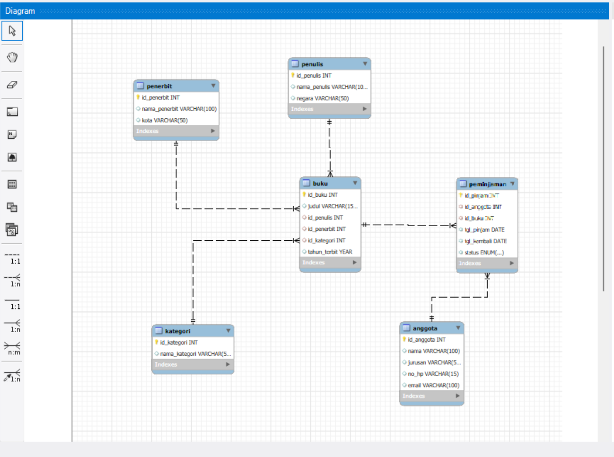
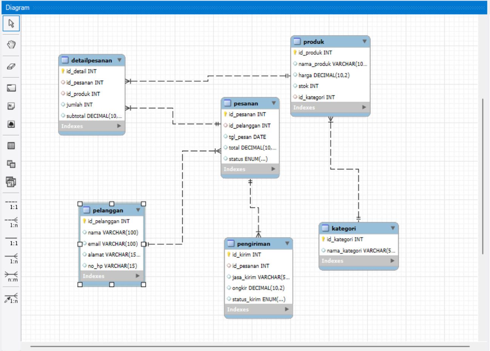
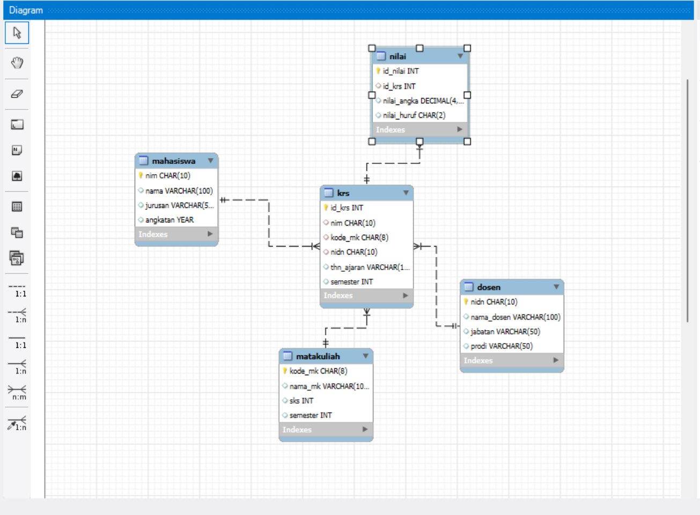
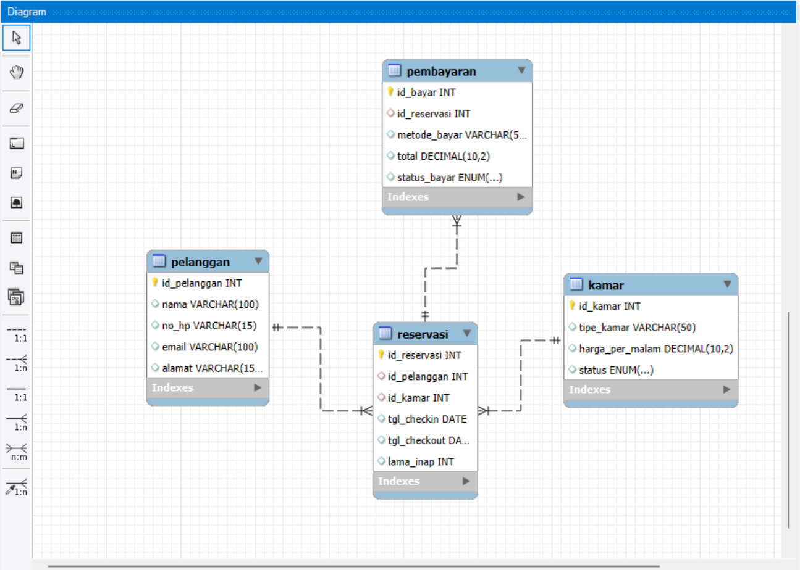

<html lang="id">
<head>
  <meta charset="UTF-8">
  <meta name="viewport" content="width=device-width, initial-scale=1.0">
  <title>Post 2 - ERD & Normalisasi</title>
  
</head>

<body>
  <!-- Navbar -->
  <nav class="navbar">
    
🌸 My Blog

    <ul>
      <li><a href="index.html">Home</a></li>
      <li><a href="profile.html">Profile</a></li>
      <li><a href="blog.html">Tugas Blog</a></li>
    </ul>
  </nav>

  

    <header>
      

        
      

      

        <h1>KAISHA KAMILA PUSPITO</h1>
        
Teknik Informatika UBP Karawang

        

          NIM : 24416255201028
          if24.kaishapuspito@mhs.ubpkarawang.ac.id
          Basis Data
        

      

    </header>

    <!-- POST 1 -->
    

      <h1>🩺 Post 1: Contoh penerapan ERD Intersection (5 kasus) </h1>
      
Berikut penjelasan singkat melalui video pembelajaran dan beberapa ilustrasi pendukung:

      <!-- Video YouTube -->
       <h3>1. Penjelasan Sistem Manajemen Rumah Sakit</h3>
      <iframe width="560" height="315" src="https://www.youtube.com/embed/n7jqsydeKMk?si=Giagw2arh8Hwfgw8"
        title="Video ERD Keys" frameborder="0" allowfullscreen> 
        
Video Penjelasan ERD Intersection

      </iframe>

      <!-- Gambar tambahan -->
       <h3>2. Tabel Sistem Informasi Perpustakaan Digital</h3>
      

        
        
Gambar 1: Sistem Informasi Perpustakaan Digital

      

      <h3>3. Tabel Sistem E-Commerce Fashion Store</h3>
      

        
        
Gambar 2: Sistem E-Commerce Fashion Store

      

      <h3>4. Tabel Sistem Akademik Kampus</h3>
      

        
        
Gambar 4: Sistem Akademik Kampus

      

      <h3>5. Tabel Sistem Reservasi Hotel</h3>
      

        
        
Gambar 5: Sistem Reservasi Hotel

      

    

    

    <!-- POST 2 -->
    

      <h1>🧩 Post 2: Apa Itu Normalisasi pada ERD?</h1>

      <h2>📘 Pengertian Normalisasi</h2>
      
Normalisasi adalah proses penyusunan tabel dalam database agar data tersimpan dengan efisien dan tidak terjadi pengulangan (redundansi). Proses ini dilakukan setelah pembuatan ERD untuk memastikan data ditempatkan secara logis dan terhubung dengan baik. Tujuannya agar database lebih rapi, konsisten, dan mudah dipelihara.

      <h2>🎯 Tujuan Normalisasi</h2>
      <ul>
        <li>Menghilangkan data yang berulang.</li>
        <li>Menjaga konsistensi dan keakuratan data.</li>
        <li>Mempermudah proses update, insert, dan delete.</li>
        <li>Membuat database lebih efisien dan cepat diakses.</li>
        <li>Memastikan hubungan antar tabel tetap logis.</li>
      </ul>

      <h2>🧱 Tahapan Normalisasi (Normal Form)</h2>
      <h3>🔹 1NF — First Normal Form</h3>
      
Setiap atribut hanya boleh berisi satu nilai (atomic). Tidak boleh ada kolom yang menampung banyak data.

      
<em>Contoh:</em> Jika satu kolom “NoTelepon” berisi banyak nomor, pisahkan jadi tabel baru.

      <h3>🔹 2NF — Second Normal Form</h3>
      
Sudah memenuhi 1NF dan semua kolom non-key harus bergantung penuh pada primary key.

      <h3>🔹 3NF — Third Normal Form</h3>
      
Sudah memenuhi 2NF dan tidak boleh ada kolom non-key yang bergantung pada kolom non-key lainnya.

      <h2>🧮 Contoh Kasus Sebelum Dinormalisasi</h2>
      <table>
        <thead>
          <tr>
            <th>NIM</th>
            <th>Nama</th>
            <th>KodeMK</th>
            <th>NamaMK</th>
            <th>Dosen</th>
          </tr>
        </thead>
        <tbody>
          <tr><td>001</td><td>Budi</td><td>MK01</td><td>Basis Data</td><td>Ibu Sari</td></tr>
          <tr><td>002</td><td>Sinta</td><td>MK02</td><td>Algoritma</td><td>Pak Budi</td></tr>
        </tbody>
      </table>

      
<strong>Masalah:</strong> Data dosen bisa berulang pada setiap baris mata kuliah yang sama, dan kalau nama dosen berubah, semua baris harus diubah satu per satu.

      <h2>💡 Setelah Dinormalisasi (3NF)</h2>
      <h3>🧑‍🎓 Tabel Mahasiswa</h3>
      <table>
        <thead>
          <tr><th>NIM</th><th>Nama</th></tr>
        </thead>
        <tbody>
          <tr><td>001</td><td>Budi</td></tr>
          <tr><td>002</td><td>Sinta</td></tr>
        </tbody>
      </table>

      <h3>📘 Tabel Mata Kuliah</h3>
      <table>
        <thead>
          <tr><th>KodeMK</th><th>NamaMK</th><th>Dosen</th></tr>
        </thead>
        <tbody>
          <tr><td>MK01</td><td>Basis Data</td><td>Ibu Sari</td></tr>
          <tr><td>MK02</td><td>Algoritma</td><td>Pak Budi</td></tr>
        </tbody>
      </table>

      <h3>📋 Tabel KRS (Relasi Intersection)</h3>
      <table>
        <thead>
          <tr><th>NIM</th><th>KodeMK</th></tr>
        </thead>
        <tbody>
          <tr><td>001</td><td>MK01</td></tr>
          <tr><td>002</td><td>MK02</td></tr>
        </tbody>
      </table>

      <h2>🧠 Kesimpulan</h2>
      <ul>
        <li>Normalisasi mengatur struktur database agar efisien.</li>
        <li>Menghindari duplikasi data.</li>
        <li>Menjaga hubungan antar entitas tetap logis dan mudah diatur.</li>
      </ul>
    

    <footer>
      © 2025 Blog Basis Data | Kaisha | 
      <a href="https://www.ubpkarawang.ac.id" target="_blank" style="color:#fff">UBP Karawang</a>
    </footer>
  

</body>
</html>
